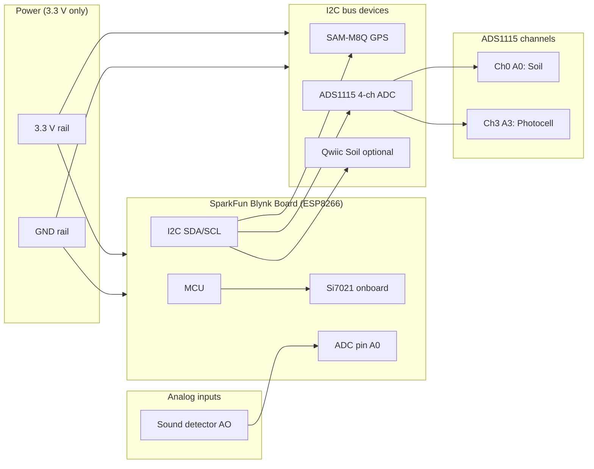
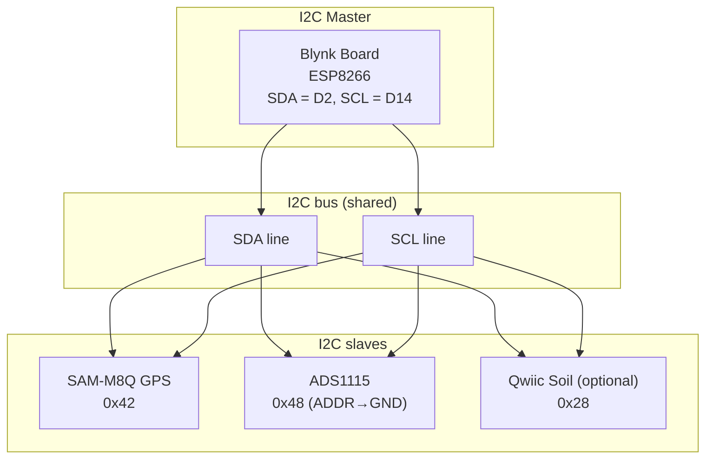
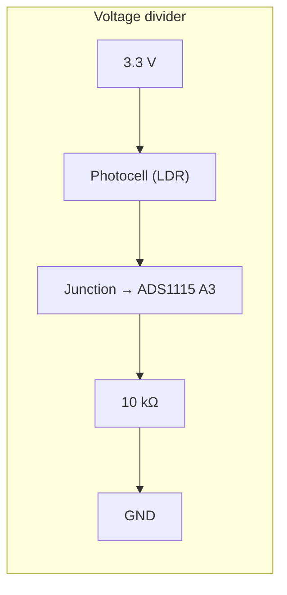
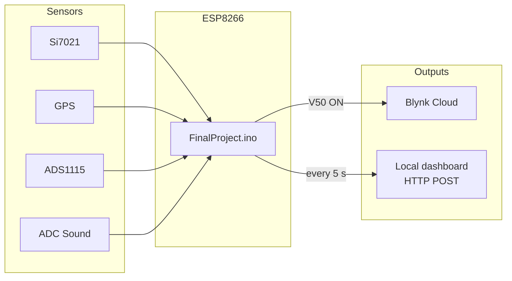

# Wiring and Circuit Diagrams for Final Paper (INF 148)

> **OUTDATED (2026-03-15):** These diagrams reflect the **earlier build** (single ADS1115, no flame/water/gas/PIR/BMP180). The current build uses two ADS1115s, PIR on GPIO 12, BMP180, MQ2, flame, water sensors. Diagrams need to be regenerated for the final paper. See `field_logger_inventory.md` for current pin map.

Use these diagrams as **Figure 1**, **Figure 2**, etc., in the written report. Render Mermaid blocks in [Mermaid Live](https://mermaid.live), VS Code (Mermaid extension), or export to PNG/SVG for insertion into the PDF.

**Old build (these diagrams):** Soil = ADS1115 Ch0 (A0) → V20, V26; Light = ADS1115 Ch3 (A3), photocell + 10k divider → V22; Sound = Blynk Board ADC (A0) → V0, V8, V21; GPS = I2C (SAM-M8Q); Si7021 = onboard. No DHT11.

---

## Figure 1: System architecture (block diagram)

High-level view: MCU, power, I2C bus, analog inputs, and data outputs.



---

## Figure 2: I2C bus topology

Shared two-wire bus: Blynk Board as master; GPS, ADS1115, and optional Soil Moisture as slaves. ADDR on ADS1115 → GND (0x48).



---

## Figure 3: Photocell voltage divider (circuit)

Light-dependent resistor (LDR) in series with 10 kΩ to form a divider. The junction (node to ADS1115 A3) goes from ~0 V (dark) to ~3.3 V (bright). Resistor can be wrapped on the photocell leg for a compact assembly.



**ASCII schematic (for caption or redraw in draw.io):**

```
    3.3 V (red)
        |
     [Photocell]
        |
        +--------→ to ADS1115 A3 (Ch3)  →  V22 (Blynk)
        |
     [10 kΩ]
        |
       GND (black)
```

**Narrative for paper:** The photocell and a 10 kΩ resistor form a voltage divider between 3.3 V and GND. The middle node is connected to ADS1115 input A3. In bright light the LDR resistance drops, so the voltage at A3 increases; in darkness it decreases. The 10 kΩ resistor can be physically wrapped or twisted with one leg of the photocell so the junction and one wire to A3 share the same electrical node.

---

## Figure 4: Pin and signal assignment (current build)

Summary of which physical pins and ADC channels carry which signals and Blynk virtual pins.

```mermaid
flowchart TB
  subgraph blynk_board["Blynk Board pins"]
    P_I2C[I2C: GND, 3.3V, SDA, SCL]
    P_ADC[ADC (A0): Sound envelope]
    P_16[GPIO 16: Door optional]
    P_15[GPIO 15: Servo optional]
  end

  subgraph sensors["Sensors / signals"]
    S_GPS[GPS I2C]
    S_ADS[ADS1115 I2C]
    S_SOIL[Soil Ch0]
    S_LIGHT[Light Ch3]
    S_SOUND[Sound AO]
  end

  subgraph vpins["Blynk virtual pins"]
    V30["V30–V34 GPS"]
    V20["V20, V26 Soil"]
    V22["V22 Light"]
    V08["V0, V8, V21 Sound"]
    V57["V5–V7 Si7021"]
  end

  P_I2C --> S_GPS
  P_I2C --> S_ADS
  S_GPS --> V30
  S_ADS --> S_SOIL
  S_ADS --> S_LIGHT
  S_SOIL --> V20
  S_LIGHT --> V22
  P_ADC --> S_SOUND
  S_SOUND --> V08
  V57
```

**Table (for paper):**

| Signal    | Source              | Connection        | Blynk pins   |
|----------|---------------------|-------------------|-------------|
| Temp/RH  | Si7021 (onboard)    | —                 | V5, V6, V7  |
| GPS      | SAM-M8Q             | I2C (Qwiic)       | V30–V34     |
| Soil     | ADS1115 Ch0 (A0)    | I2C + A0          | V20 (V), V26 (%) |
| Light    | ADS1115 Ch3 (A3)   | Photocell divider | V22         |
| Sound    | Board ADC           | Envelope → A0     | V0, V8, V21 |
| Door     | GPIO 16 (optional)  | Reed switch       | V25         |
| Servo    | GPIO 15 (optional)  | PWM               | V24, V17    |

---

## Figure 5: Data flow (sensors to cloud and dashboard)

Path of sensor data from hardware to Blynk app and local dashboard.



---

## How to use in the paper

1. **Render Mermaid:** Paste each code block into [mermaid.live](https://mermaid.live), then export as PNG or SVG. Insert the image as “Figure 1”, “Figure 2”, etc., with captions.
2. **Photocell circuit:** Use the ASCII schematic as a caption or redraw in a circuit tool (e.g. draw.io, Fritzing, KiCad) for a more formal schematic.
3. **References:** In `Final-Project-Paper-Outline.md`, the “Figures / tables” section can point to this file: e.g. “Figure 1: System architecture — see `Paper_Wiring_Diagrams.md`.”

---

## Breadboard layout reference

For a detailed row-by-row breadboard layout (Board 1 and Board 2, rails, I2C rows, ADS1115 pins), see **`Documents/2025/Breadboard.md`**. That document can be cited as the source for a “Breadboard layout” figure (photo or hand-drawn copy) in the report.
